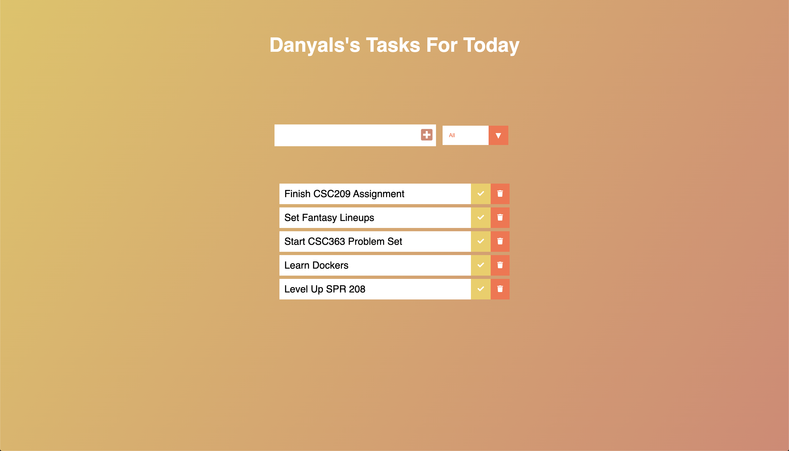
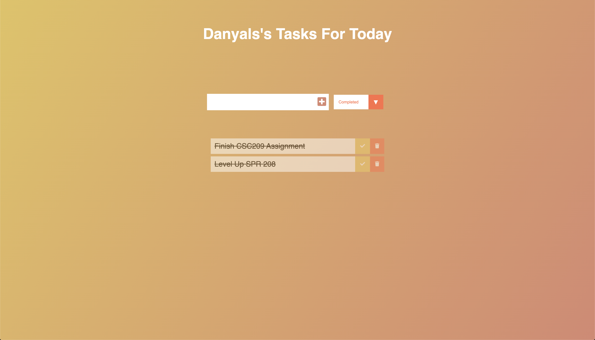
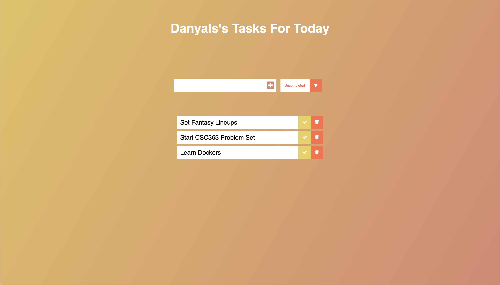
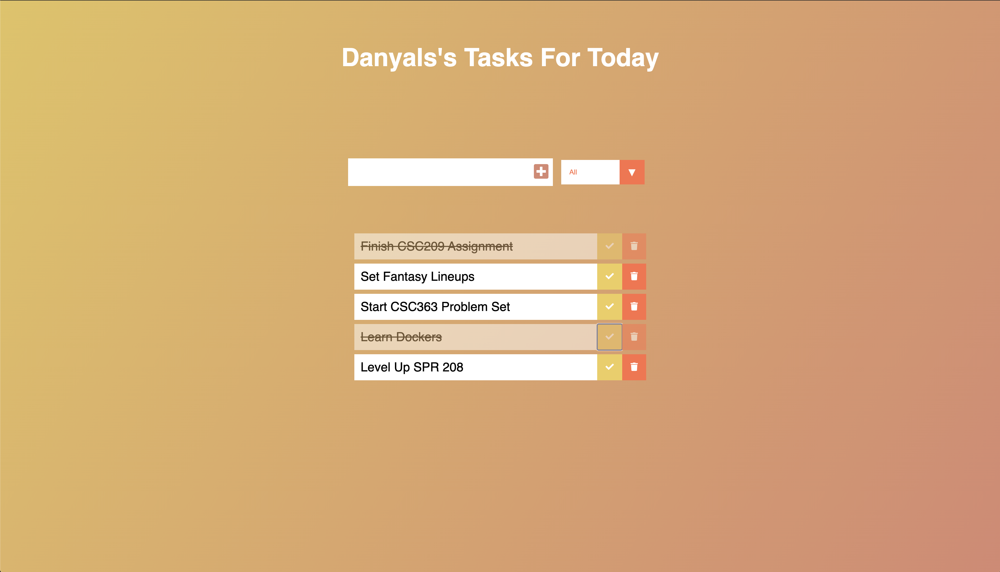

# To-Do List
Project Name: Danyal's To-Do List  
Project Date: December 2019  
Project Description:
Simple To-Do list website where you can add daily tasks.

## Features

* Open Source
* Filter by completion
* Sorting by entry
* Delete completed tasks
* Uses local storage, so if closed, data will still be retained

## Table of Contents
1. [ScreenShots](#screenshots)
2. [Installation](#installation)

## Screenshots

## Installation (Run Locally)

1. Download Code / Clone Repository

2. Navigate to folder on local machine

3. Open index.html with preferred browser

4. Enjoy!

## Suggestions
Open to any suggestions and help provided.
